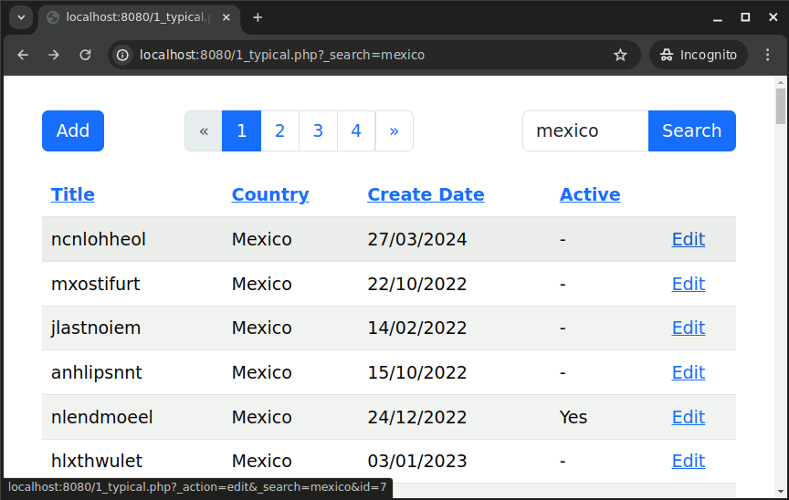
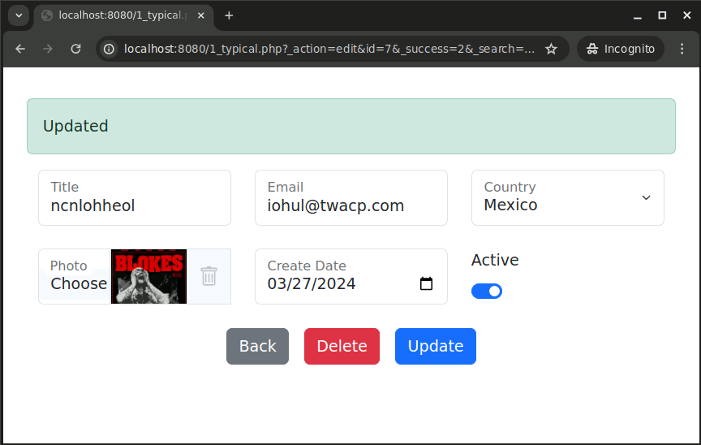

# PHP Bootstrap Table Edit - datagrid library to edit database tables

- Define table, forms, and inputs using SQL statements

- Search, column sorting, pagination, no javascript required
  
- File and image uploads to filesystem or into database field (blob)

- No built-in validation, instead it's encouraged to use HTML's *pattern* attribute, and the *required* property

- Hooks available to add validation, format data, or run code, on or after: inserts, updates, and deletes

- Styled with Bootstrap css framework

## License
MIT

## Screenshots



## Requirements
- PHP 7+ with mbstring and gd extensions enabled
- SQLite 3, MariaDB/MySQL, or PostgreSQL

## Status
This project is currently beta

## Quick demo using SQLite3 and PHP's built-in webserver

1. navigate a terminal to the 'examples/' folder
2. sqlite3 example.db < example.sql
3. php -S localhost:8080
4. open web browser to http://localhost:8080

## Install from composer

```
composer require phpbootstraptableedit/phpbootstraptableedit

```


## Important Terminology - index, add, edit

- "index" is the opening table showing all records, pagination, and search
- "add" is the form to insert new records
- "edit" is the form to update existing records


```php

$o->index_sql = "";       // sql to define the opening grid
$o->index_sql_param = []; // named params 
$o->index = [];           // field settings on index table

$o->add_sql = "";         // sql to define the fields when adding a record
$o->add_sql_param = [];   // named params 
$o->add = [];             // field settings on add form

$o->edit_sql = "";        // sql to define the fields when editing a record
$o->edit_sql_param = [];  // named params 
$o->edit = [];            // field settings on edit form

```

> [!CAUTION]
> Stop SQL injection attacks, never place user input into SQL strings!
> Instead, use *sql_param* arrays to safely pass input.

> [!TIP]
> Use the *nonce* properties to prevent Cross-site Request Forgery attacks (CSRF).


## Basic Example 
```php

$dbh = new PDO('sqlite:example.db');

$o = new PHPBootstrapTableEdit\PHPBootstrapTableEdit($dbh);

$o->table_name = 'markets';
$o->identity_name = 'id';

// define opening index table, to render the [edit] link, the last column must be the identity id
$o->index_sql = "
select m.title,
       c.title as country,
       m.create_date,
       case when m.is_active = 1 then 'Yes' else '-' end as is_active,
       m.id
from   markets m
left
join   countries c
on     m.country = c.code
where  ( coalesce(m.title, '') like :search or coalesce(c.title, '') like :search )
order by 2 desc
";

// named parameters for search
$o->index_sql_param[':search'] = '%' . trim($_REQUEST['_search'] ?? '') . '%';

// define fields on the edit form
$o->edit_sql = "select title, email, country, create_date, is_active from markets where id = :id";
$o->edit_sql_param[':id'] = intval($_POST['id'] ?? $_GET['id'] ?? 0);

// floating input style
$o->floating = true;

// define fields attributes
$o->edit['title']['required'] = true;
$o->edit['country']['type'] = 'select';
$o->edit['country']['sql'] = 'select code, title from countries'; // define how to populate the select dropdown
$o->edit['create_date']['type'] = 'date';
$o->edit['is_active']['type'] = 'checkbox';

// 12 column layout - colspan = 4 creates a three column layout
$o->edit['title']['colspan'] = '4';
$o->edit['email']['colspan'] = '4';
$o->edit['country']['colspan'] = '4';
$o->edit['is_active']['colspan'] = '4';
$o->edit['create_date']['colspan'] = '4';

// copy all 'edit' setting into 'add', the add form is the same
$o->add = $o->edit;
$o->add_sql = $o->edit_sql;
$o->add_sql_param = $o->edit_sql_param;

// call the controller
$o->run();

```

## Properties

**charset** (string), output charset, default: 'UTF-8'

**table_name** (string), database table 

**identity_name** (string), the auto increment id field in the table, typically 'id'

**index_sql** (string), sql query to define the opening html table listing all records

**index_sql_param** (array), parameters for index_sql 

Example:
```php
$o->index_sql_param = [':_search' => '%' . trim($_GET['search'] ?? '')  . '%'];
```

**add_sql** (string), sql query to define what fields to display on the add page, also what fields are in the insert

Example:
```php
// no record is returned from this query, just meta data; the field names 
$o>->add_sql = "select field1, field2, id from table where id = 0";
```

**add_sql_param** (array), named parameters for add_sql, typically not required since no records are retrieved

**edit_sql** (string), sql query to define what fields to display on the edit page, also what fields are used in the update 

Example:
```php
$o>->edit_sql = "select field1, field2, id from table where id = :id";
```

**edit_sql_param** (array), named parameters for edit_sql

Example:
```php
$o->add_sql_param[':id'] = $_GET['id'] ?? $_POST['id'];
```

**add** (array), define how fields in add_sql are rendered on the add form

Example:
```php
$o->add['country']['type']     = 'select';  
$o->add['country']['required'] = true; // normal html prop/attr
$o->add['country']['sql']      = 'select code, title from countries'; // custom html attribute to define options 
$o->add['country']['colspan']  = '3'; // layout
```

**edit** (array), define how fields in edit_sql are rendered on the edit form

Example:
```php
$o->edit['country']['type']     = 'select';  
$o->edit['country']['required'] = true; // normal html prop/attr
$o->edit['country']['sql']      = 'select code, title from countries'; // custom html attribute to define options 
$o->edit['country']['colspan']  = '3'; // layout

// or we could have copied setting from add to edit, or vice versa
// $o->edit['country'] = $o->add['country'];
```


**index** (array), define hooks to render fields on the opening table, function name, or closure

Example:
```php
$o->index['create_date']['function'] = function($data) { return date('d/m/Y', strtotime($data['value'])); };
```

**floating** (bool), enable Bootstrap's floating labels on add and edit forms. https://getbootstrap.com/docs/5.3/forms/floating-labels/

**nonce_name** (string), csrf field name, default 'nonce'

**nonce_value** (string), csrf field value

**limit** (int), pagination limit records/page, 0 = off, default = 100

**ellipse_at** (int), truncate text on index table, 0 = off, default = 0

**query_string_carry** (array) entries in this array added to all query strings, useful to carry data from page to page

Example:
```php
// carry parent_id in the querystring
// now try appending '&parent_id=5' on to the location bar; value will remain after editing, searching, or paging
$o->query_string_carry[] = 'parent_id';
```

**i18n** (array), associative array containing all localization settings

Defaults:
```php
$o->i18n['no_records' => 'No Records', 'not_found' => 'Not Found', 'search' => 'Search', 'edit' => 'Edit', 'add' => 'Add', 'add_2' => 'Add', 'back' => 'Back', 'delete' => 'Delete', 'update' => 'Update', 'delete_file' => 'mark for removal', 'update_success' => 'Updated', 'insert_success' => 'Added', 'delete_success' => 'Deleted'];
```

**css** (array), css class settings

Defaults:
```php
$o->css['index_table' => 'table-striped table-hover', 'index_active' => 'table-primary', 'pagination' => ''];
```

**redirect** (bool) helpful when debugging, set to false and page will not redirect after insert/update/delete

## 'on' Event Hooks

'on' event hook functions are called before the sql insert/update/delete. 'on' functions can be used to cast POST data or add validation.
Returning a string from an 'on_' function displays an alert on the add/edit form and skips the insert/update/delete.

- **on_insert** (closure or function name)
- **on_update** (closure or function name)
- **on_delete** (closure or function name)

Text Only Alert: 
```php
$o->on_insert = function()
{
   if(strlen($_POST['email'] ?? '') == 0) {
       return "Email Required";
   } 
}
```

HTML and Text Alerts: 
```php
$o->on_update = function()
{
    return ['html' => '<b>unescaped html, or maybe just passing some json</b>',
            'text' => 'optional, I appear in an alert div on the edit form'];

}
```

## 'after' Event Hooks

after functions are called after the SQL insert/update/delete.
after_insert is a unique hook, it's receives an argument; the inserted id.

- **after_insert** (closure or function name)
- **after_update** (closure or function name)
- **after_delete** (closure or function name)

Examples: 
```php
$o->after_insert = function($id)
{
    // i'm unique, i have the inserted id as an argument
}

$o->after_update = function()
{
    // all other hooks have to get their own identity key
    $id = $_POST['id'];
} 

```

# Normal HTML Attributes

Standard HTML attributes can be set in the *add* and *edit* arrays. They are passed through as expected

```php

$o->edit["title"]["type"]      = "text"; // text is already a default, no need to specify text
$o->edit["title"]["maxlength"] = "25";
$o->edit["title"]["foo"]       = "bar"; 
$o->edit["title"]["required"]  = true; // use true/false for properties

// outputs:
// <input name='title' type='text' maxlength='25' foo='bar' required>
```

# Custom HTML Attributes

Custom attributes instruct this library how to render the input. 
Unlike normal HTML attributes, such as maxlength, custom attributes do not appear in the input.

- **colspan** (string) Bootstrap forms have a 12 column layout, so using '4' on all fields would creates a 3 column layout; 12/4 = 3

Example:
```php
$o->edit[field]['colspan'] = "4";
```

- **div_class** (string) add a class to the div wrapping the input 

Example:
```php
// in this example 'form-switch' is added to make a checkbox render as a switch
$o->edit[field]['div_class'] = "form-switch";
```

- **label** (string), rename the title appearing with the field

Example:
```php
$o->add[field]['label']   = "Country";
$o->edit[field]['label']  = "Country";
$o->index[field]['label'] = "Country";
```

- **sql** (string) sql statement to populate a select, radio, or checkbox input 
Example: 
```php
// the first column is the value, the second column is the displayed title
$o->edit[field]['sql'] = "select code, title from countries";
```

- **sql_param** (array), associative array to hold named parameters for sql

Example: 
```php
$o->edit[field]['sql_param'] = array(":code" = $_GET['code']);
```

# Custom HTML Attributes for File Uploads

- **file_extension** (string) 
Define what type of file to accept.
For images, valid formats are png, gif, jpg, format and meta are verified at upload.
For non-images, such as doc or pdf, format and meta are not verified at upload.

Example: 
```php
$o->edit[field]['file_extension'] = 'png'; // this still allows gif or jpg to be uploaded, but saved binary will be png
```

- **file_path** (string) 
Optional, filesystem location for files to be uploaded to; a filename is stored in the database field.
If no file_path is specified, the binary content is stored directly into the database field, and no filename is saved. 

Example:
```php
// store files here:
$o->edit[field]['file_path'] = '/by/listing/a/path/file/is/saved/to/the/filesystem';

// no path means save binaries in the database field; field must be a blob, no filename is saved 
$o->edit[field]['file_path'] = null;
```    

- **file_image_width** (int) 
Optional, when file_extention is png, gif, or jpg, specify a desired width. 

Example:
```php
$o->edit[field]['file_image_width'] = 100;
```

- **file_image_height** (int) 
Optional, when file_extention is png, gif, or jpg, specify a desired height.

Example:
```php
$o->edit[field]['file_image_height'] = 100;
```

- **file_image_crop_or_resize** (string, 'crop' or 'resize')
optional, specify how to resize the image when file_extention; for png, gif, or jpg only.
'crop' creates an image accoring to width and height settings.
'resize' maintains aspect ratio of the original image while limiting size to width and height settings.
Example:
```php
$o->edit[field]['file_image_crop_or_resize'] = 'crop'; // valid options: 'crop' or 'resize'
```

# Label - Rename a field 

Rename the title appearing with the field
Example:
```php
// make country_code appear as Country
$o->add['country_code']['label']   = "Country";
$o->edit['country_code']['label']  = "Country";
$o->index['country_code']['label'] = "Country";
```

